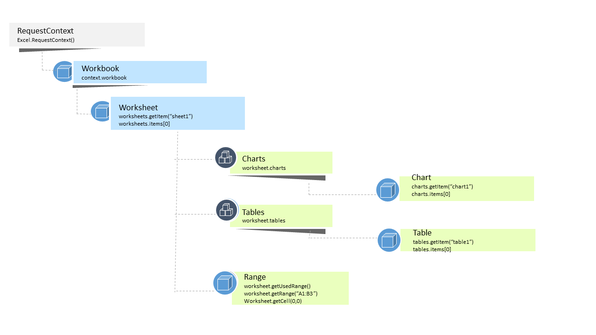

# Excel add-ins

_Applies to: Excel 2016, Office 2016_

An Excel add-in is simply a web app that you can run inside of Excel and use to interact with the contents of a workbook by using the new Excel JavaScript APIs in Office 2016. An add-in manifest file (manifest.xml) specifies where your web app is located and how to display it in Excel.
  
>**Excel add-in = manifest.xml + your own web app**

You can create two types of Excel add-ins: task pane and content. 

**Task pane add-ins** work side-by-side with an Excel workbook, and let you supply contextual information and ways for your user to enhance, view, and use spreadsheet.   
For example, a task pane add-in can look up and retrieve product information from a web service based on the product name or part number you select in the document.

**Content add-ins** integrate web-based features like rich, web-based data visualizations, embedded media content (such as a YouTube video player or a picture gallery) or other external content you choose, and show it in-line within the workbook.

## API overview

The new Excel JavaScript APIs provide a variety of Excel-specific functionality related to worksheets, tables, charts, ranges, formatting, etc. and enable you to create the next generation of Excel add-ins in Office 2016. The following diagram shows the main top-level Excel JavaScript APIs. These APIs complement features present in the existing Office.js library. 

### Get started

The following are just a few of the available resources to help you get started building Excel add-ins using the new APIs. 

Here are just a few:

1.  [Build Your First Excel Add-iniew](build-your-first-excel-add-in.md)
1.  [Excel Add-ins Programming Overview](excel-add-ins-programming-overview.md)
2.  [Excel Add-ins Code Samples](excel-add-ins-code-samples.md) 
3.  [Excel Add-ins JavaScript API Reference](excel-add-ins-javascript-reference.md)